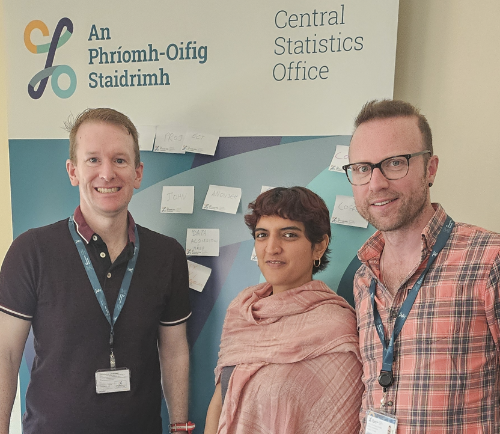
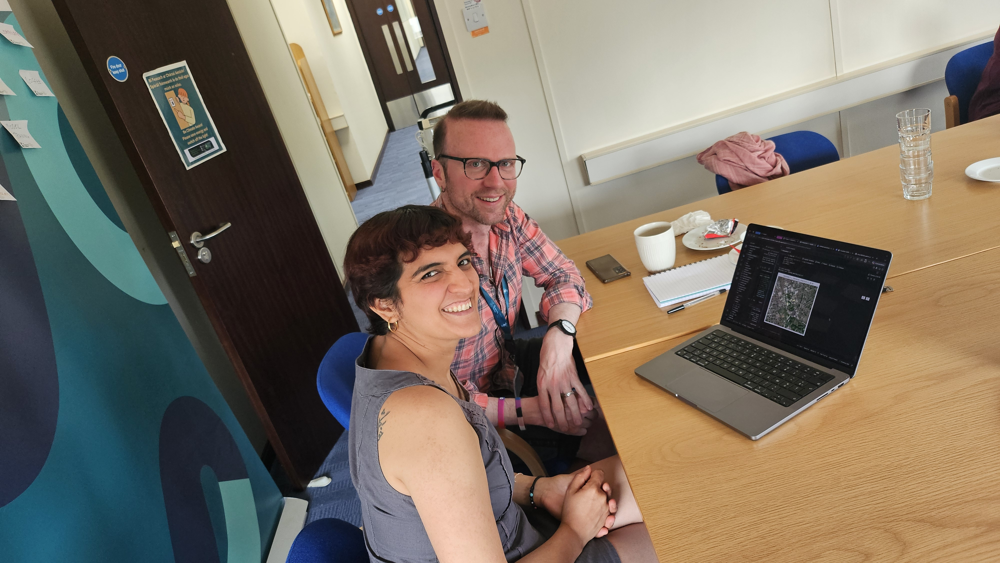

# AIML4OS Funathon Project 3 (CSO Ireland's Version)
  
This is the Repository of the 3rd Funathon project (Satellite Imaging)
27th & 28th May 2026, Working from the Swan Room, Ardee Road, Rathmines, Dublin  
Team Members (Central Statistics Office Ireland)     
+   
+ John O'Sullivan  
+ 

# Description  

This "fun" hackathon, run by Insee, involved using Semantic Segmentation to identify land cover type in Sentinel-2 Satellite Images.
more details can be found at https://aiml4os.github.io/funathon-project3/

# Fun  
we had a good time
  
